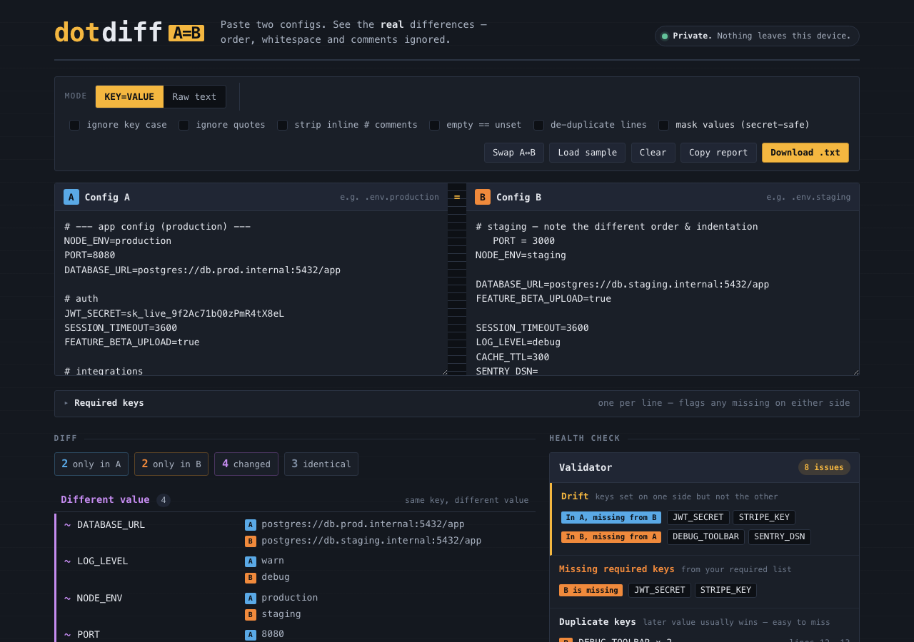

# dotdiff

Compare two `.env` / config files in your browser and see only the **real** differences — because a deploy shouldn't break over a reordered line or a stray quote.



## Why it exists

Diffing env files with `diff` is noisy: it flags reordered keys, reindentation, changed quoting and comment edits that don't actually change any value. dotdiff normalizes both sides first — ignoring key order, whitespace, quotes and comments — so what's left is the difference that matters: keys added, removed, or whose value genuinely changed. On top of the diff it runs a health check that catches the mistakes that quietly break environments: duplicate keys, empty values, type drift, and required keys missing from one side.

It's a single static page. Everything runs client-side, and a strict Content-Security-Policy (`connect-src 'none'`) means the page has no way to make a network request — so you can paste production secrets without them ever leaving your device.

## Features

- **Normalize-then-diff** — ignore key order, whitespace, quotes and inline `#` comments (each toggleable).
- **Health check** — flags duplicate keys, empty/unset values, value-type drift, and missing required keys.
- **Secret-safe** — a "mask values" mode hides values in the on-screen report and the download.
- **Raw text mode** — line-by-line diff when you need it, with optional de-duplication.
- **Export** — copy the report or download it as a `.txt`.
- **Offline & private** — no account, no upload, no server; works offline once loaded.

## Quickstart

```bash
npm install     # install dependencies
npm run dev     # local dev server with hot reload
npm run build   # static production build → dist/
npm run preview # serve the production build locally
```

Built with [Astro](https://astro.build/). The build is fully static — deploy `dist/` to any static host.

## Disclaimer

dotdiff is provided **as is**, without warranty of any kind, express or implied. It is a convenience tool: always verify its results before acting on them, especially when changes affect production configuration or secrets. The author accepts no liability for any loss or damage arising from its use. See [`LICENSE`](./LICENSE) for the full terms.

## License

[MIT](./LICENSE) © 2026 Sreenivas Sadhu Prabhakara
